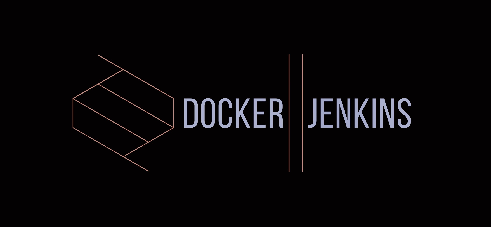

# Automation-Jenkins-Setup

Docker Setup to run UI automation in Jenkins.

[](https://www.ruby-lang.org/en/)
[](https://www.ruby-lang.org/en/)
[](nareshnavinash@gmail.com)



## Initiate:
To initiate the full setup,
```
docker-compose -p jenkins up -d nginx master proxy
```
## Log:
To check for the logs of all the images,
```
docker-compose -p jenkins exec master tail -f /var/log/jenkins/jenkins.log
```
## Kill:
To kill the whole setup,
```
docker-compose -p jenkins down -v
```
## High level Architecture:
* Master docker in which jenkins is installed.
* Two volumes are created for the master jenkins, so that even if the server gets down jenkins data will be retained.
* Have nginx server with jenkins configuration
* Have a proxy and network to link the jenkins with volumes and the child dockers
* Slave docker files to run the selenium tests with specific configuration, where chrome and firefox is installed with selenium standalone server and respective drivers.
